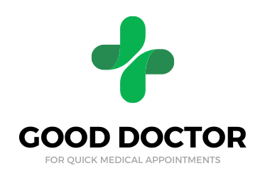
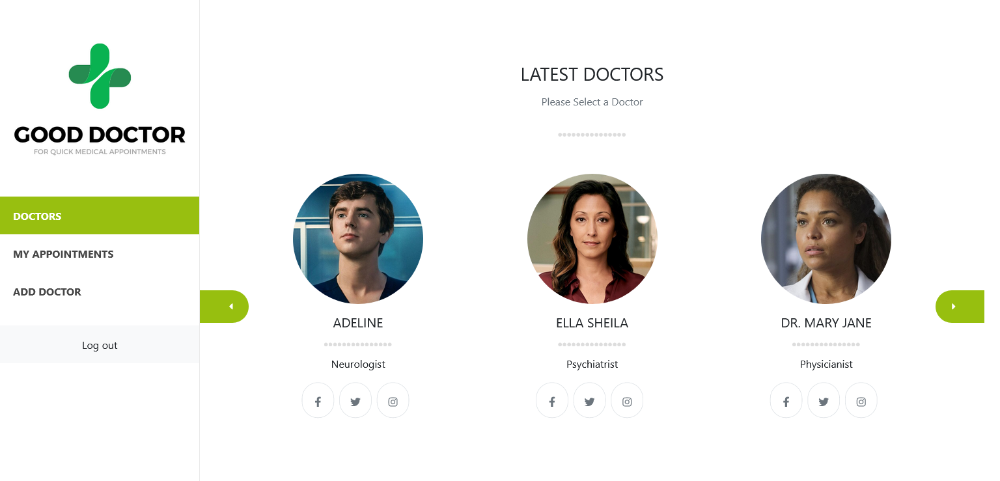
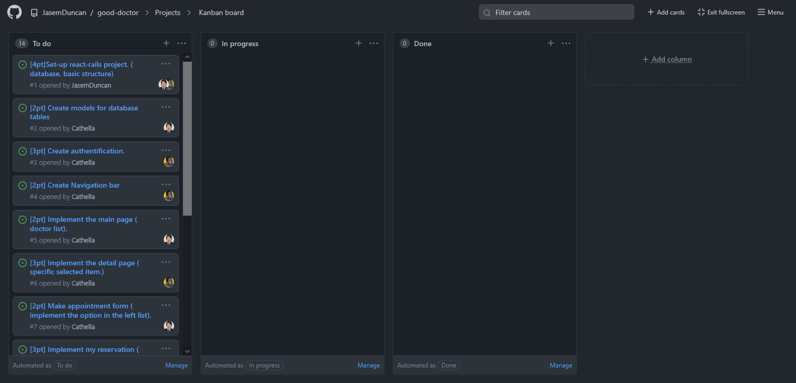

The project you are going to build for the Final Capstone Project is based on an app to book an appointment to try a motorcycle. You should follow the given design of the website, but you must personalize the content, i.e., instead of booking an appointment to try a motorcycle, you can build an app to book an appointment with a doctor, or reserve an online class with a teacher. This is highly encouraged since having unique projects in your portfolio will help you stand out while looking for jobs.

## Built With

- Ruby on Rails
- ReactJS

## Live Demo

[Live Demo Link](https://livedemo.com)

## Getting Started

To get a local copy up and running follow these simple example steps.

### Prerequisites
To run this project on a local server successfully, you should have the following installed.

- Ruby version 3.0.3
- Rails version 7.0.2
- node version v16.14.0
### Setup

- Step one is to clone the project from the project repository -> [here](https://github.com/JasemDuncan/good-doctor).
- Move into the root of the project directory by typing `cd good-doctor` in the terminal.
- In the terminal, type ` bundle install` to install the project dependencies in the Gemfile.
- Setup the postgresql database in your local enviroment.
- Run `rails db:create` to create a database, in the terminal
- Run `rails db:migrate` to create database tables.
- Run `rails db:seed` to seed some data into the database.
- Run `rails server -p 8000` to start the API server.

### Frontend Setup

- In the root of the project, type `cd frontend` to move to the frontend part of the project.
- Run `npm install` to install frontend dependencies.
- Run `npm start` to start the frontend server.
### Run tests

- To run API tests of this app, type `rspec` in the root folder of the project.

## Authors

👤 **Jasem Duncan Valencia**

- GitHub: [@JasemDuncan](https://github.com/JasemDuncan)
- Twitter: [@JasenDuncan](https://twitter.com/JasemDuncan)
- LinkedIn: [Jasem Duncan Valencia](https://www.linkedin.com/in/jasem-duncan-valencia/)

👤 **Nakitto Catherine**

- GitHub: [@Cathella](https://github.com/Cathella)
- Twitter: [@cathella9](https://twitter.com/cathella9)
- LinkedIn: [Nakitto Catherine](https://www.linkedin.com/in/nakitto-catherine2020/)

## Kanban board

Please checkout out Kanban project here - [Kanban link](https://github.com/JasemDuncan/good-doctor/projects/1)

Here is the link to the a link to the screenshot of the initial state of our Kanban board [Kanban setup](./setup_kanban_board.md).

## Original Kanban board image

Our team comprises of 2 members
 - [Jasem Duncan Valencia](https://github.com/JasemDuncan)
 - [Nakitto Catherine](https://github.com/Cathella)

## 🤝 Contributing

Contributions, issues, and feature requests are welcome!

Feel free to check the [issues page](https://github.com/JasemDuncan/good-doctor/issues).

## Show your support

Give a ⭐️ if you like this project!

## Acknowledgments

- Hat tip to anyone whose code was used
- Inspiration
- etc

## 📝 License

This project is [MIT](./MIT.md) licensed.
